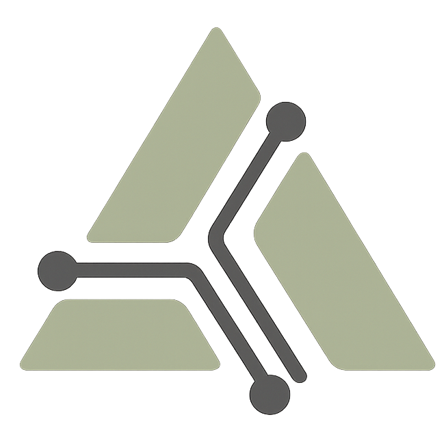

# Fraction for Laravel

<p align="center">
    
</p>

---

- [About](#about)
- [Installation](#installation)
- [Using](#using)
  - [Default](#default)
  - [Queued](#queued)
  - [Deferred](#deferred)
  - [Hooks](#hooks)
- [Contribuing](#contribuing)
- [License](#license)

---

## About

There's no denying that the "Action Pattern" in the Laravel ecosystem is extremely useful and widely used. However, action classes require "too much content" to do basic things. Let's review a basic action class:

```php
namespace App\Actions;

use App\Models\User;

class CreateUser
{
    public function handle(array $data): User
    {
        return User::create($data);
    }
}
```

We have a namespace, a class, a method, a return type, a model import, an array as a parameter... all of this to create a user. It's overkill for such a simple task, isn't it?
The solution is the **Fraction for Laravel** package. It allows you to write actions in a simpler and more direct way, without the need for all this structure. See what the same example would look like with Fraction:

```php
// app/Actions/CreateUser.php

execute('create user', function (array $data) {
    return User::create($data);
});
```

```php
namespace App\Http\Controllers;

class CreateUserController extends Controller
{
    public function store(Request $request)
    {
        // ...

        $user = run('create user', $request->all());
    }
}
```

With Fraction for Laravel, we focused on simplifying action creation while maintaining code clarity and readability and **focusing on what really matters: the action logic.** No classes, no namespaces, no fluff.

---

## Installation

```bash
composer require fraction/fraction
```

---

## Using

Primeiro de tudo, você deve criar as ações, e para isso você pode usar o comando `make:action` do Artisan:

```bash
php artisan make:action CreateUser
```

Essa ação irá gerar um arquivo em `app/Actions/CreateUser.php` com o seguinte conteúdo:

```php
<?php

execute('create user', function () {
    // ...
});
```

Por padrão, o namespace utilizado para criação e leitura de ações é `App\Actions`, mas você pode alterar isso no arquivo de configuração `config/fraction.php`:

```bash
php artisan vendor:publish --tag=fraction-config
```

Para executar uma ação, você pode usar a função `run`:

```php
run('create user');
```
Opcionalmente você pode passar argumentos para a ação:

```php
use App\Models\User;

execute('create user', function (User $user) {
    // ...
});

// ...

run('create user', auth()->user());
```

Como as ações são totalmente resolvidas pelo container do Laravel, você pode contar com a resolução de dependências do Laravel para injetar qualquer dependência necessária na ação. Por exemplo, se você quiser injetar uma instância de `Illuminate\Http\Request`:

```php
use Illuminate\Http\Request;

execute('create user', function (Request $request) {
    // ...
});

// ...

run('create user');
```
